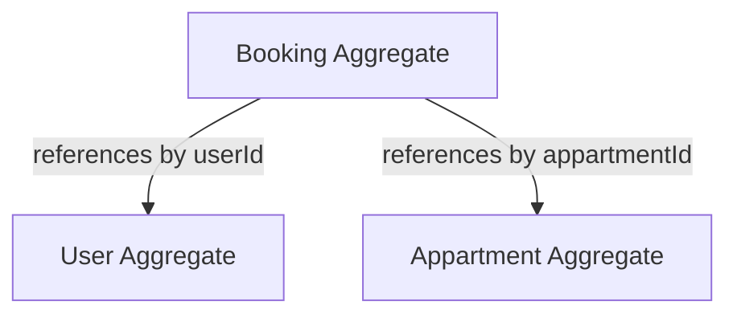
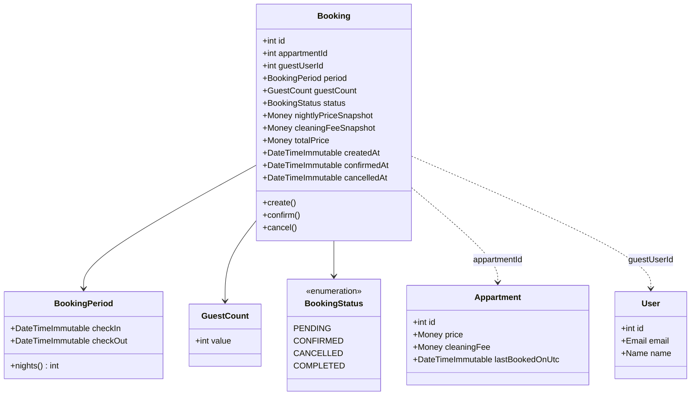
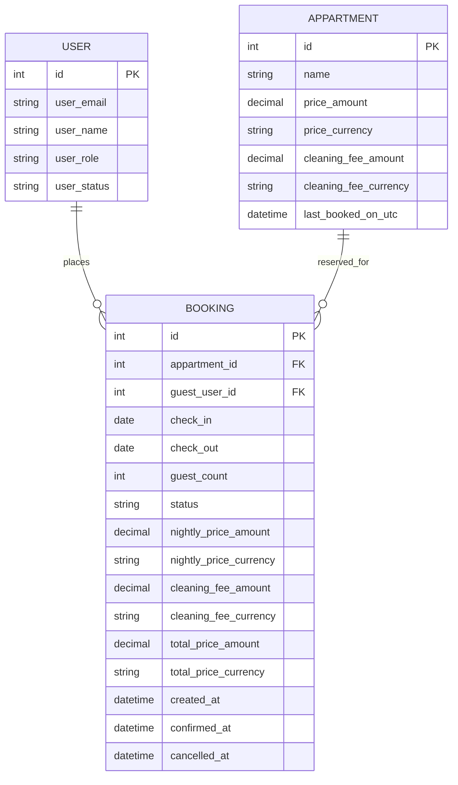
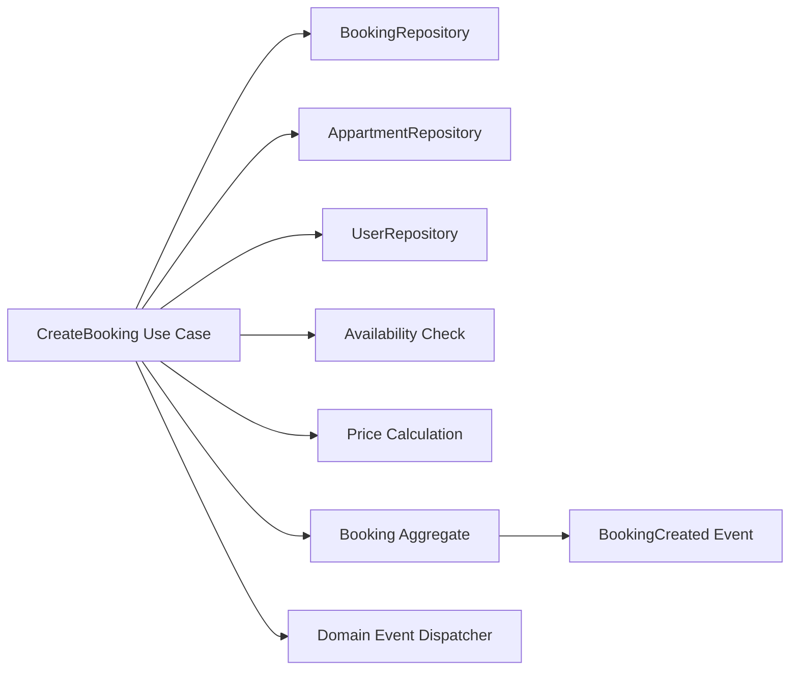
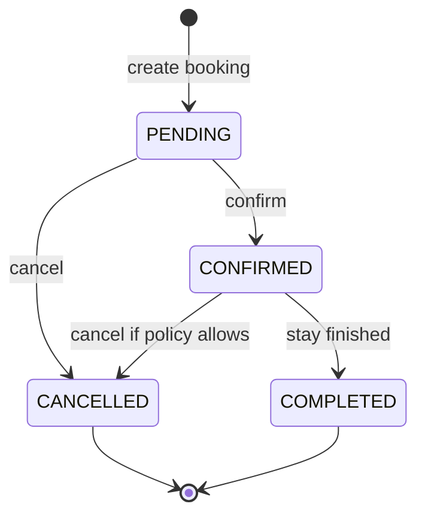
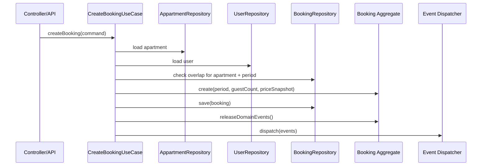
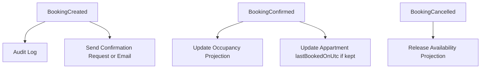

# Booking Model Plan

## Goal

Model `Booking` as a separate domain aggregate that coordinates reservations for an `Appartment` by a `User`, without coupling the aggregates too tightly.

## Core Decision

`Booking` should be its own aggregate root.

Do not embed bookings inside `Appartment` or `User`.

Reason:

- booking has its own lifecycle
- booking has its own invariants
- booking has its own events
- booking queries usually span many bookings for one apartment

## Aggregate Boundary Diagram



## Domain Concept Diagram



## Relationship Model



## Dependency Graph



## Booking Lifecycle



## Creation Flow



## Aggregate Responsibilities

### Booking Aggregate

Owns:

- booking lifecycle
- booking period invariant
- guest count invariant
- booking status transitions
- price snapshot stored at booking time
- booking domain events

Should not own:

- loading apartments
- loading users
- checking overlaps in repository
- sending emails
- updating external systems

### Appartment Aggregate

Owns:

- apartment listing/configuration
- current pricing defaults
- amenities
- address

Should not own:

- collection of booking entities as aggregate state
- booking lifecycle rules

### User Aggregate

Owns:

- identity
- role
- status

Should not own:

- booking lifecycle

## Recommended Dependencies Between Aggregates

Use identity references across aggregate boundaries:

- `Booking.appartmentId`
- `Booking.guestUserId`

Do not store:

- `Booking -> Appartment object`
- `Booking -> User object`

Reason:

- simpler persistence
- clearer boundaries
- no accidental aggregate graph loading
- repository queries remain explicit

## Suggested Value Objects

### `BookingPeriod`

Fields:

- `checkIn`
- `checkOut`

Rules:

- `checkOut` must be after `checkIn`
- stay length must be at least one night

### `GuestCount`

Fields:

- `value`

Rules:

- must be greater than zero
- optionally compare later to apartment capacity

### `BookingPriceSnapshot`

Fields:

- nightly/base amount
- cleaning fee
- total
- currency

Purpose:

- preserve historical price at booking time
- avoid recalculating old bookings from current apartment price

## Recommended Status Enum

```text
BookingStatus
- PENDING
- CONFIRMED
- CANCELLED
- COMPLETED
```

Keep this small until real workflow pressure appears.

## Recommended First Use Cases

### 1. CreateBooking

Inputs:

- `appartmentId`
- `guestUserId`
- `checkIn`
- `checkOut`
- `guestCount`

Responsibilities:

- load apartment
- load user
- validate period
- check overlap
- calculate snapshot price
- create booking
- persist booking
- dispatch `BookingCreated`

### 2. ConfirmBooking

Responsibilities:

- load booking
- validate current state
- transition `PENDING -> CONFIRMED`
- dispatch `BookingConfirmed`

### 3. CancelBooking

Responsibilities:

- load booking
- validate cancellation rule
- transition to `CANCELLED`
- dispatch `BookingCancelled`

## Recommended Events



## Persistence Recommendation

For the first version:

- Doctrine entity for `Booking`
- separate `BookingRepository`
- overlap query at repository level

Useful repository methods:

```php
existsOverlapForAppartment(int $appartmentId, BookingPeriod $period): bool
save(Booking $booking, bool $flush = false): void
find(int $id): ?Booking
findByAppartment(int $appartmentId): array
findByUser(int $userId): array
```

## Implementation Order

1. `BookingStatus` enum
2. `BookingPeriod` value object
3. `GuestCount` value object
4. `Booking` aggregate
5. `BookingRepository`
6. `BookingCreated` event
7. `CreateBooking` use case
8. overlap query
9. tests

## Important Open Questions

Before implementation, decide:

1. Is booking always tied to a registered user?
2. Do staff create bookings on behalf of guests?
3. Should `confirmed` exist, or is create immediately confirmed?
4. Are overlapping `PENDING` bookings allowed?
5. Should apartment pricing be snapshotted at booking time?
6. Should `Appartment.lastBookedOnUtc` stay once booking exists?

## Recommended First Slice

Build this first:

- `Booking`
- `BookingPeriod`
- `GuestCount`
- `BookingStatus`
- `BookingCreated`
- `BookingRepository::existsOverlapForAppartment()`
- `CreateBooking` application service

Keep payment, refunds, and async notifications out of the first slice.
